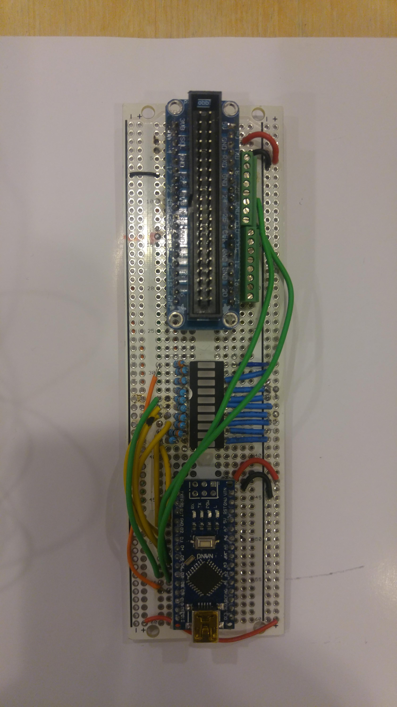
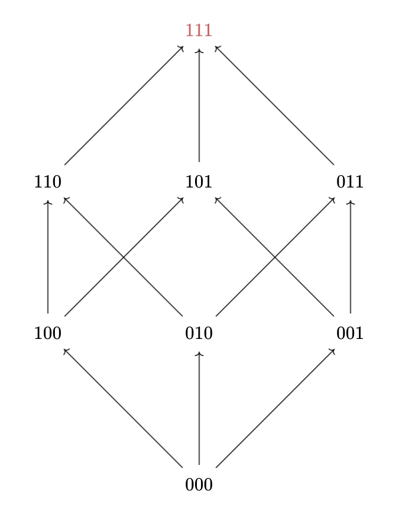
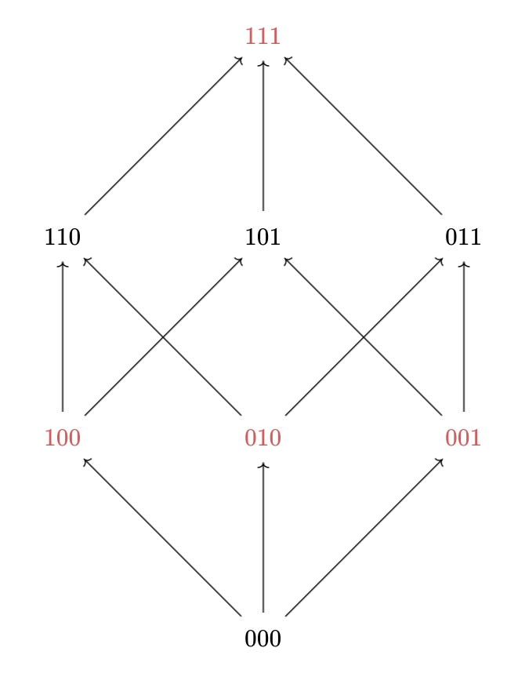
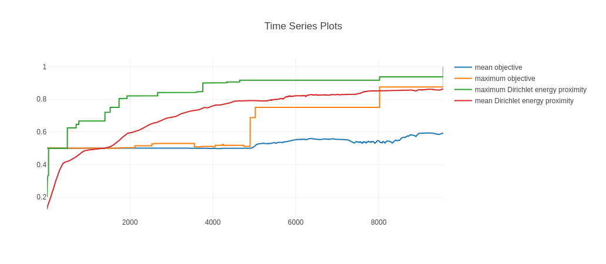

# Introduction

Since the submission of our third milestone report, we've been working towards the integration of the three principal modules of the REFUSR project: the hardware interface or "Refuduino PLC Whisperer", the "Cockatrice" genetic programming engine, and the probabilistic property testing module.


# Hardware Developments


The focus for this phase of the work has been a further exploration of the interactions of the OpenPLC code with the target MCU. Recall from our earlier work that the "Refuduino" hardware platform consists of a Raspberry Pi SBC running the OpenPLC software wired to an Arduino Nano microcontroller. A Symbolic Expression generated by the GA/Junta synthesizer is wrapped in a boilerplate Structured Text(ST) program which communicates to the Arduino MCU. Our initial approach took a classic data communications protocol approach with the use of the GPIO pins connected between the two devices to drive a clock and indicate state such as Ready-To-Send, Clear-To-Send, Result Ready, etc. and also to present a set of random values used to seed the values for the Symbolic Expression to compute over. 

While these sorts of protocols are suitable for low-level communication protocols such as SPI, I2C, or TTL serial communication, it has proven overly complex for this work. For one, the data being sent between the two devices is much more akin to a noise generator function than an actual data communication. There is no real meaning or value behind the order of bits being sent over the %IX  lines so there's no real need for synchronization between the two devices. This obviates the start/stop signals and the need for a clock pulse. This makes the role of the Arduino more akin to a "Numbers Station" or noise-generator. 

Given the original approach of treating the Arduino-side as a sort of "Busy Box" with multiple small functions that could be deployed against different PLC applications, we see this development as a gain of function vs reduction. This places it much closer to PLCs as they are deployed "in the wild", which listen and act on electrical signals sent across individual pins vs. streams of serial data multiplexed across a dedicated IO channel.


## Glitching 

Following the August PI meeting and the discussion regarding electrical glitching attacks on embedded processors with devices like the Chip Whisperer, we made some brief attempts at glitching the pins on the Refuduino. Using the signal generator on the SeeedStudio DSO (Digital Storage Oscilloscope)Nano, we were able to induce state changes on the state pins of the Refuidino and get the code to act on this manipulation. A square wave with a period of 100ms and 5V voltage was used. 

## Board Revisions

Following the August PI meeting and demonstration of our hardware, a soldered-down version of the Refuduino was built, using the same BOM as the initial breadboard-ed prototype (see figure {@fig:refuduinoV2}). Screw-terminals have been added to this build allowing the physical connections for signalling to be changed as the software was changed. Development is also proceeding with a Teensy 4.1 board, which uses an ARM Cortex M7 32-bit CPU with onboard Ethernet controller that provides the ability to run MODBUS over TCP
. The Refuduino can now act as a MODBUS Server and we have exercised this with PyModBus scripts running on a Linux host on a local network in our hardware lab. The OpenPLC server remains connected to the Teensy via an IDC cable, unaware that the board is also connected to a network and other MODBUS TCP clients. 

This takes the MCU from a place of acting as a simple target device for the OpenPLC server into one where it can fully interact with other inspection, logging and analysis tools, while at the same time continuing its role in the Symbolic Expression computation task.  We are interested in possible further development of this tool with others either inside or outside the ReMath effort who might find a sort of "PLC Pineapple" device appealing. 

{#fig:refuduinoV2}

{#fig:refuduinoV3}

# Development of pin-level monitoring tools with Frida

The [OpenPLC](httsp://www.openplcproject.com) platform has proven to be a useful platform on which to base our initial round of PLC development. It's Open Source and has proven easy to setup and run our ST code on. It is still very much in development and has minimal logging and debugging facilities however.

To address these challenges we've developed some simple tools using [Frida](https://frida.re), a low-level inspection framework written in Javascript with Node.js, Python, Swift and C++ bindings, which is also Open Source.
There are currently two Python scripts `openplc-read-all-pins.py` and `openplc-read-set-pin.py` which use the [Frida Python module](https://pypi.org/project/frida/).

These tools have let us inspect and set pin-state on the Raspberry Pi GPIOs.
This not only provides a side inspection channel onto OpenPLC, it also gives us another point to establish an Oracle on the whole process.
We can copy the %IX pin states fed into the Symbolic Expression and store the evaluated result with the generated bitfield.
These following sections describe the trials and problems we encountered when developing these tools.

## GPIO pin numbering
One of the first problems we ran into when developing these tools, is that there exists at least four different "pin enumeration" schemes for the GPIO pins on the RPi.
There is the physical numbering (1-40), BCM numbering (which physical pin from the SoC its connected to, 0-27), wiringPis own numbering (0-29) and OpenPLCs numbering (%IXx.y for inputs and %IQx.y for outputs).
This posed a problem when actually trying to refer to what pin had what value, because the native pin numbering that wiringPi uses is its own numbering.
This meant that we had to make a translation table that translates the wiringPi numbers, to the OpenPLC numbers, to be able to make sense of the output without having to translate it manually when reading the output from the tools.

## Tooling OpenPLC with frida
One of the main problems we were having with the PLC code being run by OpenPLC, is that the debug functionality is near non-existent for OpenPLC.
OpenPLC has a small monitoring dashboard, that automatically is created to show the state/value of the different inputs and outputs.
The biggest problem with this dashboard, is that its refresh resolution doesn't go below 100ms, which is way too long cycles to be able to see any type of change in state on I/O between the restart of the task.
It was clear that we needed some other tool, that was able to read the I/O state in more of a real-time capacity than the provided monitoring dashboard.

There exists a library called [wiringPi](http://wiringpi.com/) that is widely used to read/write the GPIO pins available on the raspberrypi (RPi).
OpenPLC uses this library to use the GPIO pins to make a RPi into a PLC, and exposes these pins to PLC programs.
The pinout that OpenPLC uses can be shown [here](https://www.openplcproject.com/runtime/raspberry-pi/pinout.png) where it can be seen overlaid over the RPi physical pinout.

The option was between using the `gpio` cli tool that uses wiringPi to access the GPIO pins, write our own program utilzing wiringPi and instrument the compiled binary that OpenPLC creates when you upload a PLC program to it.
We chose the third choice mainly because if we have the frida harness already setup for the binary, if we want to glean more internal state than just the state of different GPIO pins, its easy to tweak the scripts we inject into the OpenPLC binary.
The other reason for instrumenting with frida, over using the already supplied gpio cli tool or writing our own cli tool using the wiringPi library, is that the main reason we needed another tool to view pin state other than the OpenPLC monitoring dashboard, with a higher resolution than 100ms.
Had we used the supplied gpio cli tool or written our own, we would have the problem of syncing our reading/writing of the GPIO pins in between the reading/writing that the OpenPLC binary was doing to not get clobbered or clobber the functioning of the OpenPLC binary.

There is also a cli tool that is provided by the frida framework, `frida-trace`, that can be used to trace arbitrary functions on arbitrary processes and was very helpful in poking around to see what information that could be gotten through the frida API.
However, even tho it gives all the information in real-time, there is no way to format the output from that tool or to enrich the output like to translate the pin numbering to the OpenPLC pin numbering scheme.
Therefor we decided to use frida to hook the digitalRead and digitalWrite functions that the OpenPLC binary uses, through fridas python API.
That way, we get the information about the state of the pins, at the same time that the OpenPLC binary gets/writes the information.

After doing a trial run with just hooking the digitalRead/digitalWrite functions and outputting whatever value that was gotten from that, it was evident that we needed to coalesce this data and output it at a fixed interval of our own choosing.
The reason for this is that the OpenPLC binary reads/writes all I/O pins at an interval that is approximately 20ms +- 5-10 ms, which means that the terminal running the tool very quickly gets spammed with values, which makes it near impossible to actually read any information.

## The tools
So far, two tools was made to help with debugging the pin state, one that continously outputs the coalesced pin state every second and one that allows reading/writing boolean values from/to pins.
They are publish in this [repository](https://github.com/lejonet/rpi-openplc-gpio-tools).
They are not limited to attaching to OpenPLC binaries to output the state of pins, any binary that uses the wiringPi library and its digitalRead/digitalWrite functions can be instrumented by them.
This is why the first positional argument of both tools is a PID or process name, and if none is given, it defaults to attaching to the process called "openplc" as that is the name of the binary that OpenPLC produces and runs.

The first tool, `openplc-read-all-pins.py`, was the only tool that was originally planned to be created, to create a cli-based dashboard-like tool akin to the monitoring dashboard that OpenPLC has through its web frontend.
But as we started trying to debug the PLC code that was running on the RPi, it became clear that we needed a tool to be able to read/write an individual pin because not everyone had access to the Refudino hardware.
Not having access to the Refudino hardware meant that there was no way to actually give the PLC program any inputs to test that part of the code.
Thus the second tool, `openplc-read-set-pin.py`, was made.
Unlike the `gpio` cli tool, the `openplc-read-set-pin.py` tool uses the OpenPLC numbering to choose which pin to read/write from.
This simplified the process of reading/writing pins that were of interest from the PLC codes perspective, because no translation between the different pin numbering schemes needed to be done.
The tool hooks the digitalRead/digitalWrite functions, just like `openplc-read-all-pins.py`, but exports them as python functions that can be used indepently from the usage in the OpenPLC binary.

## UI
One of the plans with these tools, is to refine the UI for at least the `openplc-read-all-pins.py` to some type of Terminal UI (TUI) that updates itself, instead of just outputting row after row in the terminal.
That way, the pin state changes could be shown in real-time without risking losing data because it scrolls past in the terminal too quick.


# Using Dirichlet Energy as a Gradient in the Search for Recalcitrant Functions

Macready and Wolpert's well-known "No Free Lunch" theorem [[@Wolpert1997NoFreeLunch]] informs us -- counterintuitively, perhaps -- that not only is there no optimization or search algorithm that performs better than random search across all problem domains, but *that the average performance of **any** given search algorithm across all domains is equal*. Whatever better-than-random performance a particular algorithm finds in one domain is paid for in its performance in some other.

<!-- break it down to (1) the target of the search and (2) the choice of gradient. motivate the quest for additional gradients. -->


## The Difficulty with Parity Functions

In our [[milestone_3|Milestone 3 report]], we showed that REFUSR is capable of reliably discovering programs that implement moderately complex Boolean functions, such as the randomized 4-to-1 Multiplexor, a function on the 6-dimensional Boolean hypercube, the randomized 8-to-1 Multiplexor, which lives on the 11-dimensional hypercube, and an assortment of randomly generated functions of similar size.

The situation that confronted us when we turned to the 6-bit parity problem looked quite different. If we left the system running for long enough, eventually an answer would sometimes be found, but an examination of the logs made this appear to be little more than dumb luck. None of the phenotypic traits we'd designed seemed to have discovered any reliable gradient in the fitness landscape, until the very end. As trivial as the solution to the problem might be for a human programmer to solve -- odd-parity is, after all, just an $n$-ary XOR, and even-parity its negation -- for our existing GP system, it was a needle in a haystack. The situation was even worse when we attempted to solve 11-bit parity, which brought the system to a standstill, each of our fitness metrics flatlined. What few successes we had depended on the cheap trick of reducing the system's primitive operations to just `XOR` and `MOV`, and even then it could take upwards of 26,000 tournaments to find a solution.

<!-- provide some details, throw up some plots -->
<!-- TODO: spin up another Pluto notebook to generate these plots? or just load them into the dashboard and use that. probably the latter. -->

This probably shouldn't have been such a surprise. The genetic programming literature is scattered with references to *parity* being a particularly difficult problem to solve. The classic point of reference, on this score, is John Koza's 1992 tome, [[@Koza1992GeneticProgrammingProgramming]]. Koza recognized parity as a particularly difficult function to discover through evolutionary synthesis. Even in as few as four dimensions, the task proved arduous. 

![[Pasted image 20211028234255.png]]
![[Pasted image 20211028234055.png]]

Without the support for modularity afforded by *automatically defined functions* (ADFs), genetic search for parity functions of higher dimensionality remained intractable. (With ADFs, he was able to reach 11-bit parity functions.)

But *why* is parity so difficult? What is it about that function in particular that makes it recalcitrant to genetic search, or, more precisely, to the measures we had so far implemented to track our evolving populations' proximity to their target? It's not a function of particularly great Komolgorov complexity, being in the end nothing more than an $n$-ary `XOR` or `IFF` (for odd and even parity, respectively).

What observation of our runs that *failed* to discover 11-bit parity show us, it seems, is that *at no point was a reliable gradient discovered*. Neither of the two fitness metrics we had provided at that point -- to wit:

+ hamming distance, modified by fitness sharing
+ maximal mutual information between intermediary states of the execution trace and the target

-- did anything but flatline in the face of 11-bit parity. Even when we heavily biased the instruction set, stripping it of everything but `MOV` and `XOR` -- the minimal ingredients necessary to construct a simple solution -- success would arrive in the form of a long, uneventful flatline, suddenly punctuated by a lucky guess and a leap, or maybe two, before landing on the solution by chance. <!-- TODO insert a figure or two here -->

So what is it about *parity*, this formally quite basic and threadbare GP benchmark, that makes it so difficult to discover?

<!-- What does the existing lit say? Enumerate some possibilities. -->

## Measures of Boolean Function Sensitivity

We brought this problem up in a conversation with Douglas Kutach, back in August, and reflected that what seemed most conspicuous about parity is its "volatility": changing any single bit of the input will change the output. This seemed like an interesting thread to pull on, and the ensuing path of research led me to the question of the *[[sensitivity of boolean functions]]*. 


<!-- TODO: consider moving this down to after the initial introduction of Sensitivity, and motivate it differently. that would give this section a smoother narrative arc! -->

The first idea that occurred to us was that it might be meaningful to classify a $n$-ary Boolean function $f$ by the number of maximal contiguous posets in the partition induced by $f$ on the lattice $\mathbb{B}^n$. 
 
The function $\& : \mathbb{B}^3 \rightarrow \mathbb{B}$, for example, partitions the Hasse graph of $\mathbb{B}^3$ into two subgraphs (two "contiguous posets").

{#fig:and3cube}

By contrast, the function $\oplus: \mathbb{B}^3 \rightarrow \mathbb{B}$ carves $\mathbb{B}^3$ into 8 continguous posets, or, to think of it another way, *connected components* of the 3-cube. This is also the function we call *odd-parity*. And we can see that it has the distinguishing feature of mincing up the hypercube as finely as possible -- a feature it exhibits as plainly on the 3-cube as it does on cubes of every dimension. Flipping a single bit will *always* change the value of the function.

{#fig:xor3cube}
Let's fix some terminology here: the structures that we're considering here can be seen as the Hasse diagrams of Boolean lattices, but since we're primarily concerned with their connective properties, from this point on we're just refer to them as *n-dimensional hypercubes graphs*, or just *hypercubes*.

Following this train of thought took us on a brief detour through the existing literature on the *[[sensitivity of boolean functions]]*. 


## From Sensitivity to Dirichlet Energy

The notion of measuring Boolean functions' "sensitivity", in the sense we're going to describe here, first surfaced in Noam Nisan's 1989 paper, "CREW PRAMS and Decision Trees" [[@Nisan1989CREWPRAMSDecision]]. What Nisan provides us with is as follows:

> Notation: let $w$ be a boolean string of length $n$, let $S$ be any subset of indices, $S \subset \{1 \cdots n \}$, then $w^{(S)}$ means the string $w$ with all bits in $S$ flipped. I.e., $w^{(S)}$ differs from $w$ exactly on $S$.

> **Definition**: Let $f$ be a boolean function, and $w$ any input string, and $i$ any index. We say that $f$ is *sensitive* to $x_i$ on $w$ if $f(w) \neq f(w^{(i)})$. The *sensitivity* of $f$ on $w$, $s_w(f)$, is the number of locations $i$ such that $f$ is sensitive to $x_i$ on $w$. The *sensitivity* of $f$, $s(f)$ is the **maximum** over all $w$ of the sensitivity of $f$ on $w$. (330)

This notion went on to spawn a cottage industry of theoretical computer science publications, predominantly concerned with whether or not a polynomial relation could be established between this measure of sensitivity and others, such as "certificate sensitivity" and "block sensitivity". These don't concern us here.

There are a few points where we might try to refine Nisan's definition, somewhat, or at least mould it into a shape that could be of more use to us. Instead of thinking of "input strings", let's place ourselves again in the hypercube, and consider each $w$ as a vertex. The other input strings $\left\{w^i | 0 <= i < length(w)\right}$, each reachable from $w$ by flipping a single bit, are the *neighbours* of vertex $w$ in the hypercube (where edges represent bit-flips). Now instead of taking the *count* of neighbours $w^i$ of $w$ such that $f(w^i) \neq f(w)$, let's consider the sum of squared differences $\Sigma (f(w^i) - f(w))^2$. In a Boolean context, of course, these measures are so far equivalent. If $f(w^i)$ differs from $f(w)$ it can only be by an absolute value of 1, and so this sum is never equal to anything other than the count. The reason for rewriting things this way, in the end, is just to bring out the resemblance of Nisanian "sensitivity" to another more general property.

Anyone coming to Nisan's notion fo sensitivity in hopes of finding a property that might allow them to classify and distinguish between various Boolean functions might be disappointed to see how much information it simply throws away. It wantonly disposes of the fine-grained (and implicitly graph-theoretic) information that it gathers together under the rubric of "local sensitivity", only to take the *maximum* local sensitivity over the set of possible input strings (i.e., the vertices of the hypercube).


Let's go back to our examples of $\& : \mathbb{B}^3 \rightarrow \mathbb{B}$ and $\oplus : \mathbb{B}^3 \rightarrow \mathbb{B}$ (figures {@fig:and3cube} and {@fig:xor3cube}, respectively). These functions are equally "sensitive" in the Nisanian sense, because each has *at least one* vertex where *any* of three bitflips will change the value of the function. The difference, of course, is that in the case of `XOR`, *every* vertex has this property, whereas when it comes to `AND` only the top vertex, `111`, is so volatile. The rest have a local sensitivity of either 1 (in the case of `110`, `101`, and `011`) or 0, for the rest. This difference isn't difficult to capture: we *could* simply say that `XOR` -- or, to give it another name, *odd parity* -- induces a greater *average local sensitivity* on the vertices of the hypercube than `AND` does. In fact, we could observe that it's **maximal**: there is no function on $\mathbb{B}^3$ that could induce greater local sensitivity than `XOR`/$\oplus$/odd-parity. Every vertex already has a local sensitivity equal to the number of dimensions. 

If instead of taking the maximum local sensitivity over the vertices in the cube, we take the *mean* or *expected* local sensitivity, then we have something considerably more fine-grained in our hands: 

$$\frac{\sum_{v,v' \in V(\mathbb{G})}\{\left((f(v) - f(v')\right)^2  : v' \text{ is a neighbour of } v \text{ in } \mathbb{G}\}}{| E(\mathbb{G}) |}$$^energy-sketch

If this formula seems familiar, it's because what we're looking at now a measurement of the *Dirichlet energy* of a Boolean function over the hypercube graph.


### Measuring Dirichlet Energy

<!-- TRANSITION --> <!-- TODO: this should be easy to finish up today. going to do so after a few quick errands -->

In the code below, `HyperCube` is just an alias for a labelled graph type, which, in this context, is exclusively used to represent a $n$-dimensional Boolean cubes, where each vertex is labelled with a $n$-bit vector, and edges connect all and only those vertices whose vectors differ by a single bitflip. (That is to say, adjacent vertices stand at a hamming distance of 1 from one another.)

```julia
function local_energy(Q, v)::Rational
    f(x) = get_prop(Q, x, :value) |> Rational
    value = f(v)
    neighbourhood = f.(all_neighbors(Q, v))
    abs.(neighbourhood .- value) |> mean
end


function evaluate_on_hypercube!(f, Q::HyperCube)
    for v in vertices(Q)
        set_prop!(Q, v, :value, f(get_prop(Q, v, :bits)))
    end
    Q
end


function dirichlet_energy(f, dim)
    Q = hypercube(dim)
    evaluate_on_hypercube!(f, Q)
    (local_energy(Q, v) for v in vertices(Q)) |> mean
end
```


<!-- motivate, define, give examples -->

<!-- diagrams, using the visualize_cube functions in the Sensitivity module. -->

## Dirichlet Energy Proximity as a Fitness Pressure

## Returning to the 11-bit Parity Problem

See [this experiment](http://0.0.0.0:9124///2021/10/26/Parity-11-xor.16-03-57) for details.

### Trial 1

![[parity-11-plot-trial-1.png]]


### Trial 2

![[parity-11-plot.png]]


#### Effective Code

22 Instructions (50.0%)

```
001.    R[04] ← R[04] xor D[05]
003.    R[05] ← R[05] & D[05]
006.    R[08] ← R[08] xor D[05]
007.    R[08] ← R[08] xor R[08]
009.    R[04] ← R[04] xor D[11]
011.    R[07] ← R[07] | R[05]
012.    R[07] ← R[07] | D[04]
013.    R[07] ← R[07] xor D[06]
015.    R[01] ← R[01] | D[02]
016.    R[07] ← R[07] xor R[01]
017.    R[05] ← ~ R[07]
018.    R[08] ← R[08] xor D[08]
022.    R[04] ← R[04] xor D[10]
023.    R[02] ← ~ D[07]
025.    R[04] ← R[04] xor R[08]
027.    R[02] ← R[02] xor D[01]
030.    R[06] ← ~ R[05]
033.    R[02] ← R[02] xor D[09]
035.    R[02] ← R[02] xor R[04]
036.    R[06] ← R[06] xor R[02]
039.    R[01] ← ~ R[06]
043.    R[01] ← R[01] xor D[03]
```


## 12-bit Parity



![[parity-12-plot.png]]

## 13-bit Parity

Even if we increase the dimension yet again, and move from a search space of $2^{2^12}$ functions (instantiated over an even greater number of programs) to one of $2^{2^13}$ functions, the Dirichlet energy gradient reliably guides us towards the parity function.  

![[parity-13-plot.png]]

The solution in this case came from the island whose interaction matrix is presented in the lower left quadrant of figure <!-- TODO label figures -->. 

![[parity-13-im.png]]


<!-- And we can expect the performance of Dirichlet energy proximity, as a fitness function, to be proportionate to the distance of the target function's energy from 0.5 -- the peak of the binomial distribution of energy across functions. -->


### The Shape of the Dirichlet Energy Distribution

It would be unreasonable, of course, to expect the Dirichlet energy gradient to furnish a royal road to just *any* Boolean function. Its power in providing a path to the parity functions depends on the parity functions belonging to a very small class of *Dirichlet energy maximizers* -- mirrored by an equally small, but computationally simpler, class of *Dirichlet energy minimizers*, which are just the constant functions: $(\lambda x . 1)$ and $(\lambda x . 0)$.

What's of interest here is that Dirichlet energy provides a gradient for functions that have eluded our other, general purpose fitness functions -- namely, shared hamming distance and trace information. There is, after all, no free lunch, and it would be mistaken to expect any particular gradient is the gradient to rule them all. The performance of every possible fitness function averages out equally, when considered across the entire domain of functions.

We conjecture that the difference between a candidate function's Dirichlet energy and the energy of the target function can provide us with an extremely powerful search gradient *so long as functions with an energy equal to that of the target function are rare*. The parity functions are, in this respect, truly ideal targets.

But what does the distribution of Dirichlet energy over the general space of $n$-dimensional Boolean functions look like?

In low-dimensional spaces, like the 3-cube, we can answer this question through the admittedly lazy method of brute force. The histogram shown in {@fig:energy-histogram-3cube} illustrates what appears to be a *binomial distribution* of Dirichlet energy over the 256 Boolean functions on the 3-dimensional cube.

![[energies_on_3cube_histogram.png]]{#fig:energy-histogram-3cube}

We are rarely dealing with the *totality* of functions on the $n$-cube, however, especially when $n$ is even moderately large. There are, for example, exactly 1090748135619415929462984244733782862448264161996232692431832786189721331849119295216264234525201987223957291796157025273109870820177184063610979765077554799078906298842192989538609825228048205159696851613591638196771886542609324560121290553901886301017900252535799917200010079600026535836800905297805880952350501630195475653911005312364560014847426035293551245843928918752768696279344088055617515694349945406677825140814900616105920256438504578013326493565836047242407382442812245131517757519164899226365743722432277368075027627883045206501792761700945699168497257879683851737049996900961120515655050115561271491492515342105748966629547032786321505730828430221664970324396138635251626409516168005427623435996308921691446181187406395310665404885739434832877428167407495370993511868756359970390117021823616749458620969857006263612082706715408157066575137281027022310927564910276759160520878304632411049364568754920967322982459184763427383790272448438018526977764941072715611580434690827459339991961414242741410599117426060556483763756314527611362658628383368621157993638020878537675545336789915694234433955666315070087213535470255670312004130725495834508357439653828936077080978550578912967907352780054935621561090795845172954115972927479877527738560008204118558930004777748727761853813510493840581861598652211605960308356405941821189714037868726219481498727603653616298856174822413033485438785324024751419417183012281078209729303537372804574372095228703622776363945290869806258422355148507571039619387449629866808188769662815778153079393179093143648340761738581819563002994422790754955061288818308430079648693232179158765918035565216157115402992120276155607873107937477466841528362987708699450152031231862594203085693838944657061346236704234026821102958954951197087076546186622796294536451620756509351018906023773821539532776208676978589731966330308893304665169436185078350641568336944530051437491311298834367265238595404904273455928723949525227184617404367854754610474377019768025576605881038077270707717942221977090385438585844095492116099852538903974655703943973086090930596963360767529964938414598185705963754561497355827813623833288906309004288017321424808663962671333528009232758350873059614118723781422101460198615747386855096896089189180441339558524822867541113212638793675567650340362970031930023397828465318547238244232028015189689660418822976000815437610652254270163595650875433851147123214227266605403581781469090806576468950587661997186505665475715792896 Boolean functions on the 13-cube. And the set of programs that instantiate these functions, and which can be constructed with the program constructors at our disposal, will tend to be even larger, depending on various parameters (the number of operations and registers available, the maximum length of programs, and so on).

It may be interesting to inquire, then, about the distribution of energy over *samples* from the set of $n$-dimensional functions when the sampling policy is not uniform.

We can consider, for example, three distinct ways of generating a "random function" $f: \mathbb{B}^n \rightarrow \mathbb{B}$:

1. we could first generate a random Boolean vector `v`, with uniform probability, and then, while holding `v` fixed, use it as a "lookup table" for the function, by interpreting the function's parameters as the binary expression of the integer `i` and returning `v[i]`. It's clear that, so long as the bits composing `v` can be sampled uniformly, so can the space of functions. In the plots below, we'll refer to this method of generated random functions as *Uniformly sampled tables*.
2. we could recursively generate *expressions* as abstract syntax trees, using the same program generation algorithms used by Koza in [[@Koza2005GeneticProgramming]]. The function `f`'s parameters are then bound to the free variables in the expression and the expression is evaluated. `f` then returns the result of this evaluation. In the plots that follow, we'll refer this function generator with the abbreviation *AST*, followed by a specification of the maximum depth of the tree and the primitive operations, or nonterminals, used.
3. finally, we could employ the algorithms that we're already using in Cockatrice to generate random vectors of register-transfer language (or "virtual assembly") instructions, and then execute the instruction vector or "program" in the virtual machine that Cockatrice uses to evaluate candidate programs (i.e., to establish the genotype-phenotype map). Whatever value is contained by the return register, `R1`, is then returned by `f`.


![[energy_distributions_in_3_dimensions.png]]

![[energy_distributions_in_4_dimensions.png]]

![[energy_distributions_in_5_dimensions.png]]


![[energy_distributions_in_6_dimensions.png]]

![[energy_distributions_in_8_dimensions.png]]


![[energy_distributions_in_10_dimensions.png]]


# Probabilistic Property Testing: Beyond the Junta Property and into Signature Space

## Performance Improvements to the Junta Tester

Improving the performance of the junta tester described in [[@Liu2018DistributionFreeJuntaTesting]]
has been a major priority. In the original implementation, the tester struggled to deal with problems of about 15-20 bits in an interactive session on a workstation. This is more or less the dimension at which exhausting the input space at each stage of the evolutionary search becomes prohibitively expensive, and the use of PPT-informed approximations and constraints becomes increasingly relevant. Significant improvements to performance were obtained by two changes: parallelization of the search over the input set's powerset, and memoization of the powerset calculation.

<!--
The junta checker, in the outer loop of the main algorithm, searches the powerset of the set of inputs not yet found to be in the junta. This search is parallelized, leading to a nearly linear speedup in the number of available threads of execution. The occasions at which it is necessary to lock shared data structures tend to be brief and infrequent.

The calculation of the powerset of the set of remaining inputs itself was being done in a redundant manner, leading to a large expenditure of both time and memory allocations early in the search. The calculation of the powerset was memoized, so that it would be performed only once per change in the set of remaining inputs to search. Locking only needed to be implemented around the memoized function itself (to protect the memoization data structure from concurrent modification) and so had minimal impact on parallelizability.

Memoization improved performance by several orders of magnitude. Parallelization of the search over the input set powerset yielded a nearly linear scaling in available parallel threads of execution, meaning that on a typical workstation, Boolean functions in as many as 30 dimensions (i.e., $f : \mathbb{B}^{30} \rightarrow \mathbb{B}$) can be tested for the junta property in an interactive fashion. We anticipate that additional hardware resources will allow us to scale the performance in a linear fashion. 
-->

## Property Testing and Monotonicity

We had previously developed a tester for a fundamental nontrivial property of boolean functions: the junta property. A subset of size $k$ of a function's inputs are said to form a $k$-junta when knowing that subset is sufficient to determine the output of the function for all inputs. Thus, determining this property permits one to restrict the search space for other properties to only those inputs known to influence the output of the function, since inputs outside the junta set can be ignored as they do not influence the function's output at any point in the input space.

<!--
We have considered whether the methods that we are currently using to test for the junta property can be fruitfully extended to other properties of Boolean functions, as well. Of particular interest here are the following:

 - Special properties of functions that arise in the study of graphs, such as the *Dirichlet energy* of a function, described in section {@sec:dirichlet};
 - Complexity measure and cryptographic related properties, such as block sensitivity and certificate complexity;
 - Quantum computation related properties such as quantum query complexity;
 - Linearity, a nonlocal and highly specific property which is efficiently tested for boolean functions only with fairly complex techniques such as spectral methods on truth table data;
 - Symmetry-related properties;
 - Tree-decomposition properties, which are already used as the hypotheses in the genetic module.

None of these specific properties promised to be of use for the identification of general functions, since generally they suffered from either or both of two deficiencies: a) they would be unlikely to hold outside functions from the domains where they are defined, or b) testing methodologies for them are complex or of an efficiency inadequate for use in the inner loop of a search, which they would typically be in our application.

The final property family listed, tree-decomposition properties, was by contrast useful, but the information associated with the property, that is, an explicit representation of a function as a tree of boolean operations, is already developed in a more specific form than a tester would produce, that is, the explicit tree of operations, in the genetic module. Thus, testing for the property separately would be redundant, or at least would require devising a method for doing the work of the genetic module in a distinct and complementary manner, which is expected to be of similar complexity to the existing genetic module itself, and thus was deemed impractical to implement, and beside that, out of scope of the property testing module, which exists to inform the search performed by the genetic module using information from the function oracle, rather than to supplant the genetic module entirely.

-->
This being the case, two other approaches were considered. First, a direct implementation of the general purpose function property testing methodology in  Chapter 6 of [[@Goldreich2017IntroductionPropertyTesting]]; and second, an adaptation of some of the concepts in the aforementioned technique to augment the existing junta tester with the ability to check a fairly general subfamily of general properties, but in a more efficient way than the fully general tester. The second approach was taken up and implemented.

## Pointwise property testing

In order to take advantage of previous work on junta testing to support the identification of general functions, the notion of a pointwise property test was defined and used to implement a sampling-based approach to property testing at individual input points. **A _pointwise property_ is one that can be defined in terms of the behavior of the function under study at single input points.** It includes many properties of interest, notably 1-monotonicity.

$k$-monotonicity is defined such that a function $f$ is said to be $k$-monotonic if, given an ordering relation $\leq$ on inputs, and the function $f$, for all sequences of inputs $x_i$, for all $i$, $x_(i-1) \leq x_i$, then $f(x_i) \neq f(x_{i-1})$ at most $k$ times. In the case of 1-monotonicity, checking sequences of length 1, that is, perturbations of a single input at a single bit, suffice.

This observation inspired the following approach to function identification by computing fingerprints based on pointwise property behavior at sensitive points.

## Pointwise test-based function fingerprinting

Based on the junta tester's operation in terms of a search for inputs that, when perturbed at a single bit position, yield a change in the output, testing of arbitrary properties at such points was implemented. The junta tester now takes an optional parameter of a predicate to test at all such found points, and returns a log of the result of testing the predicate between the original and perturbed point.

This log is then condensed into an information-preserving fixed dimensional binary vector that serves as a signature of the function's pointwise property behavior, by means of which functions can be compared directly in terms of where in their input spaces the pointwise property under consideration does or does not hold.

### Hyperdimensional Codes

The aforementioned information-preserving fixed dimensional binary vectors are computed according to techniques that Kanerva introduced in [[@Kanerva2009HyperdimensionalComputingIntroduction]]. The vectors of points and the property behavior at those points are hashed and the hash is used to seed a random number generator that is in turn used to generate a random sparse bit vector with fixed dimension and number of set bits. These individual vectors are combined into a vector of the same dimension that preserves information from the individual vectors and represents, in that alternate form, the set or superposition of the information in the individual vectors, which serves as the function fingerprint. Distances between the fixed-dimension fingerprint vectors correlate with distances between the original vectors of unbounded size, permitting efficient distance-based comparison. 

Tools to compute and manipulate hyperdimensional codes were added to a supporting library containing tools for working with bitvectors.

Our eventual goal is to exploit these distance measures as a *fitness pressure*, providing yet another gradient for our genetic search.


